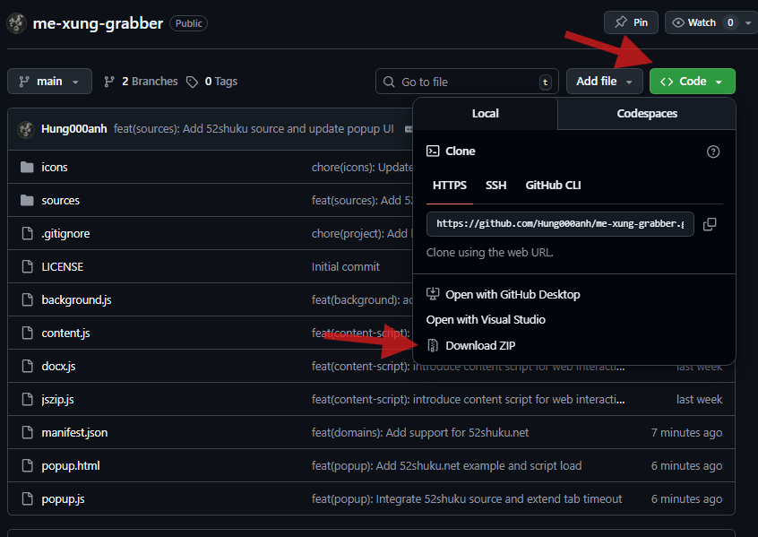
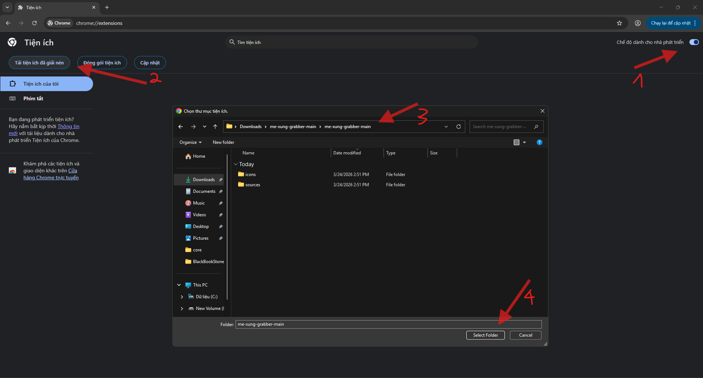
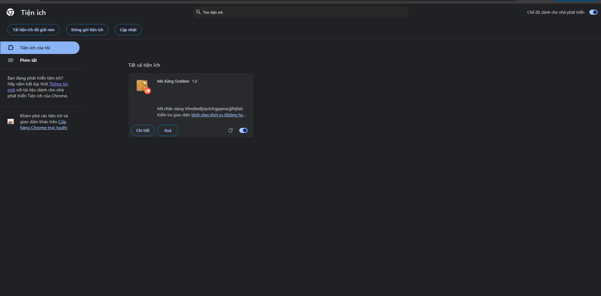
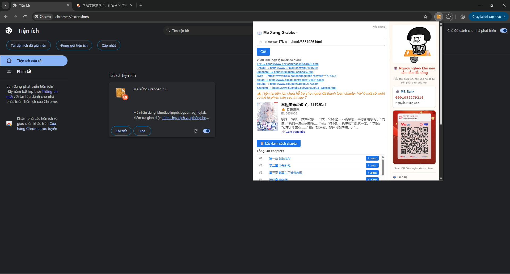

# 📖 Mè Xửng Grabber – Installation Guide

## 1. Tải source code

Clone hoặc download project về máy:

```
git clone https://github.com/Hung000anh/me-xung-grabber
```

hoặc tải file `.zip` rồi giải nén.

---

## 2. Mở Chrome Extensions

Truy cập:

```
chrome://extensions/
```

Bật **Developer mode** (góc trên bên phải).

---

## 3. Load extension

* Nhấn **Load unpacked**
* Chọn thư mục `me-xung-grabber-main` (thư mục chứa `manifest.json`)

---

## 4. Kiểm tra

* Extension sẽ xuất hiện trong danh sách
* Pin extension lên thanh toolbar (tuỳ chọn)
* Click icon để mở popup

---

## 5. Sử dụng

* Dán URL sách (17k, jjwxc, qidian, biquge, ...)
* Nhấn **Gửi**
* Lấy danh sách chapter hoặc tải `.docx / .zip`

---

## 6. Lưu ý

* Một số site có **CAPTCHA / anti-bot** → cần mở tab và xác minh thủ công
* Không hỗ trợ chapter VIP đã thanh toán (tuỳ site)
* Không đóng popup khi đang tải nhiều chapter

---

## Yêu cầu

* Google Chrome (khuyến nghị bản mới)
* Bật quyền `Developer mode`

---

## License
MIT License

Copyright (c) 2026 AnhNguyen

Permission is hereby granted, free of charge, to any person obtaining a copy
of this software and associated documentation files (the "Software"), to deal
in the Software without restriction, including without limitation the rights
to use, copy, modify, merge, publish, distribute, sublicense, and/or sell
copies of the Software, and to permit persons to whom the Software is
furnished to do so, subject to the following conditions:

The above copyright notice and this permission notice shall be included in all
copies or substantial portions of the Software.

THE SOFTWARE IS PROVIDED "AS IS", WITHOUT WARRANTY OF ANY KIND, EXPRESS OR
IMPLIED, INCLUDING BUT NOT LIMITED TO THE WARRANTIES OF MERCHANTABILITY,
FITNESS FOR A PARTICULAR PURPOSE AND NONINFRINGEMENT. IN NO EVENT SHALL THE
AUTHORS OR COPYRIGHT HOLDERS BE LIABLE FOR ANY CLAIM, DAMAGES OR OTHER
LIABILITY, WHETHER IN AN ACTION OF CONTRACT, TORT OR OTHERWISE, ARISING FROM,
OUT OF OR IN CONNECTION WITH THE SOFTWARE OR THE USE OR OTHER DEALINGS IN THE
SOFTWARE.

Lưu ý: 
Chỉ sử dụng cho mục đích cá nhân, học tập và nghiên cứu.
